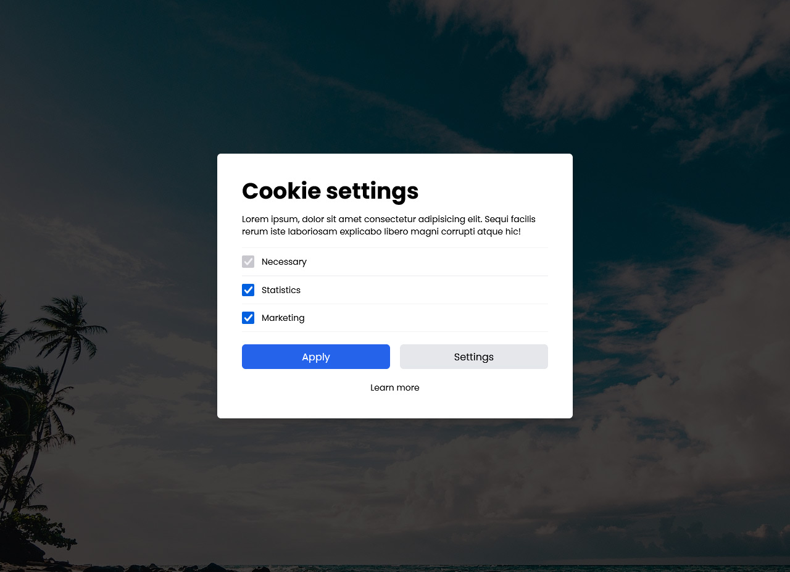

# Tailwind CSS Cookie Modal

Tailwind CSS documentation: [https://tailwindcss.com/docs](https://tailwindcss.com/docs)

Background image: [Pexels](https://www.pexels.com/hu-hu/foto/tenger-termeszet-eg-strand-994605/)

    <!DOCTYPE html>
    <html lang="en">
    <head>
        <meta charset="UTF-8" />
        <meta http-equiv="X-UA-Compatible" content="IE=edge" />
        <meta name="viewport" content="width=device-width, initial-scale=1.0" />
        <title>Tailwind CSS - Cookie Modal</title>
        <!-- Google Fonts -->
        <link rel="preconnect" href="https://fonts.googleapis.com" />
        <link rel="preconnect" href="https://fonts.gstatic.com" crossorigin />
        <link href="https://fonts.googleapis.com/css2?family=Poppins:wght@400;700&display=swap" rel="stylesheet" />
        <!-- Tailwind CSS -->
        <link href="https://unpkg.com/tailwindcss@^2/dist/tailwind.min.css" rel="stylesheet" />
        
    </head>
    <body>
        

        

            <h3 class="text-2xl md:text-4xl font-bold mb-4">Cookie settings</h3>
            

            Lorem ipsum, dolor sit amet consectetur adipisicing elit. Sequi facilis rerum iste laboriosam explicabo libero
            magni corrupti atque hic!
            

            

            

                <label class="flex items-center">
                <input type="checkbox" checked disabled class="w-5 h-5" />
                Necessary
                </label>
            

            

                <label class="flex items-center">
                <input type="checkbox" checked name="statistic" id="statistic" class="w-5 h-5" />
                Statistics
                </label>
            

            

                <label class="flex items-center">
                <input type="checkbox" checked name="marketing" id="marketing" class="w-5 h-5" />
                Marketing
                </label>
            

            

            

            

                <button type="button" class="px-4 py-2 bg-blue-600 text-white rounded-md w-full">Apply</button>
            

            

                <button type="button" class="px-4 py-2 bg-gray-200 text-black rounded-md w-full">Settings</button>
            

            

            

            <a href="#nogo" class="hover:underline hover:text-blue-600">Learn more</a>
            

        

        

    </body>
    </html>
